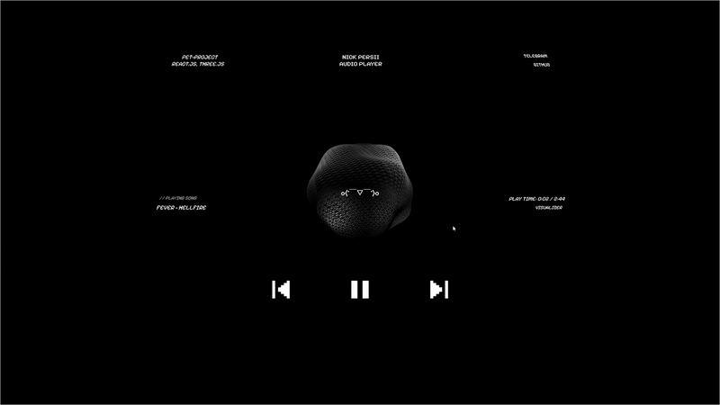

# 🎵 Audio-Visualizer Player

> **Русский:** Аудиоплеер с визуализацией на Three.js, реагирующей на музыку в реальном времени.  
> **English:** Audio player with a real-time music-responsive 3D visualization using Three.js.  

---

## 🎬 Демонстрация проекта / Project Demo

 
 
**Русский:**  
Наслаждайтесь аудиоплеером с интерактивной 3D-анимацией. Каждое аудио трек изменяет форму и движение объектов на экране.  

**English:**  
Enjoy the audio player with interactive 3D visuals. Every track dynamically influences shapes and animations in real-time.  

---

## ✨ Основные фичи / Features

**Русский:**

- 🎶 Воспроизведение аудио файлов прямо в браузере  
- 🌐 3D визуализация аудио в реальном времени с использованием Three.js  
- 💨 Динамическая деформация объектов под музыку  
- 🎨 Возможность кастомизации визуальных эффектов  
- ⚡ Высокая производительность благодаря React + Three.js + Vite  
- 🔧 Простая интеграция и расширяемость  

**English:**

- 🎶 Play audio tracks directly in the browser  
- 🌐 Real-time 3D audio visualization with Three.js  
- 💨 Dynamic object deformation responding to music  
- 🎨 Customizable visual effects  
- ⚡ High performance with React + Three.js + Vite  
- 🔧 Easy integration and extensibility  

---

## 🛠 Технологии / Tech Stack

**Frontend:**  

- ⚛ React 19  
- 🌌 Three.js (3D visualization)  
- 🖌 @react-three/fiber & @react-three/drei  
- 🎛 Simplex Noise for procedural animations  
- ⚡ Vite (fast bundler & dev server)  
- ✅ ESLint & Prettier for code quality  

---
